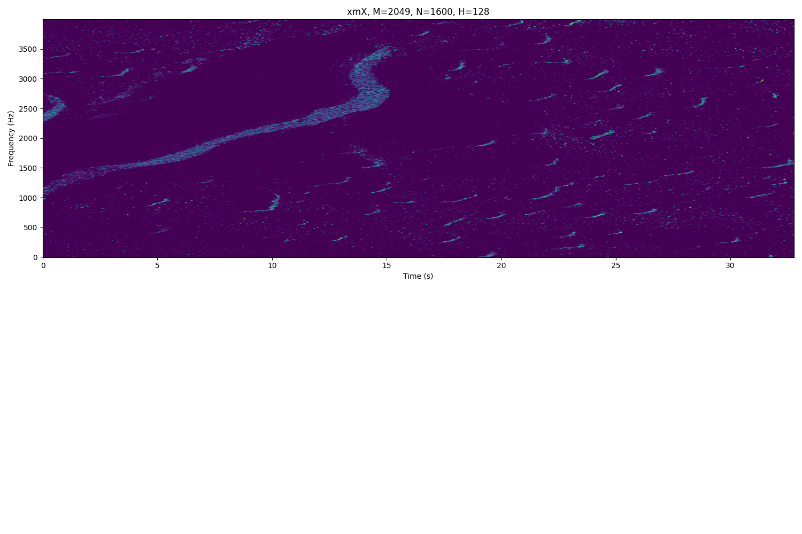

# Image to audio
Python package to convert image to audio. The system interpretates the images as raw spectrograms and synthetize the audio using customizable iFFT parameters.

## Install
```
pip install -r requirements.txt
```

## Process an image
```
python main.py --image_path=<PATH_TO_THE_IMAGE> --hop_size=512 --out_name=<NAME_OF_OUTPUT_AUDIO>.wav --sample_rate=16000
```





- The higher the sample rate, the higher the content of high frequencies, but the length of the output audio gets shorter
- The higher the hop_size, the higher the resolution and longer the length of the audio file (it slows down the playback). Very slow hop_size will lead into harmonic artifacts (could or could not be wanted...). 

I recomend using images with large resolution (~4000px x 3000px), a hop size of 512 and a sample_rate of 16000 to obtain ~1.5 min of audio.

## Test
TODO